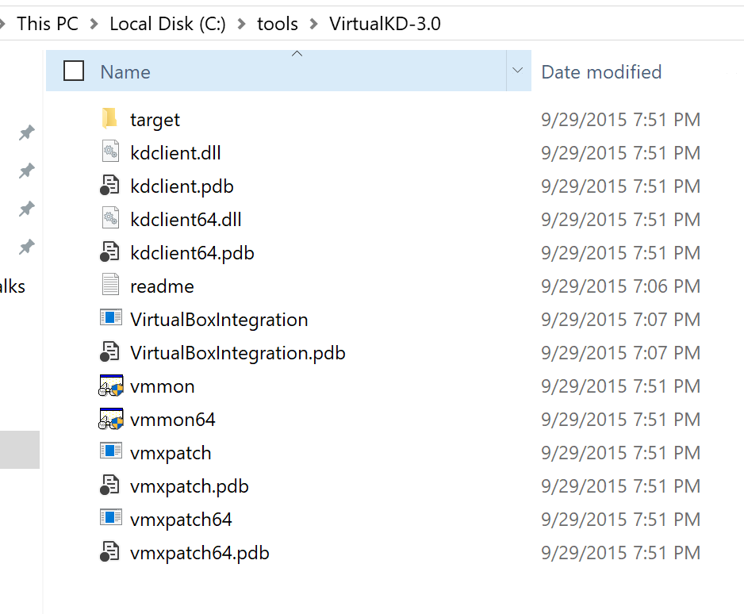
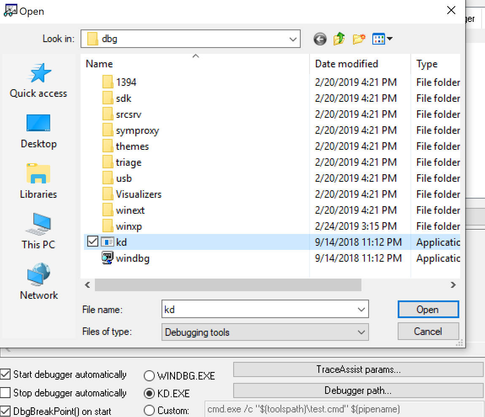
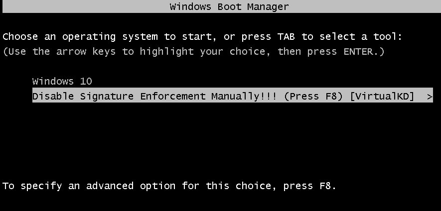
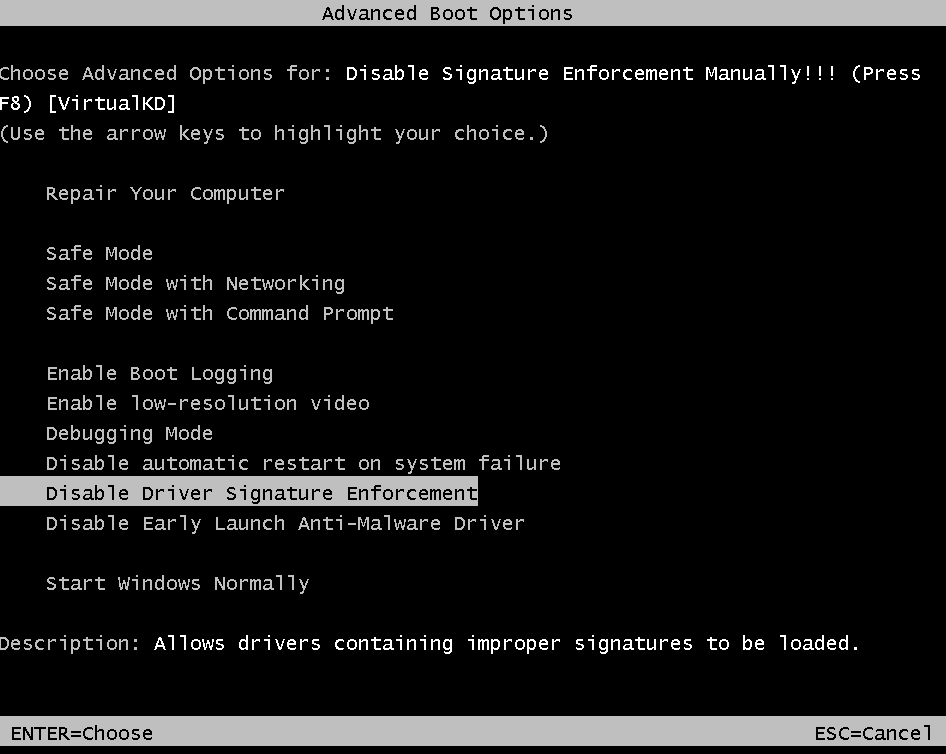

# Setting up kernel debugging (VirtualKD)

VirtualKD is a custom KD transport protocol specialized for VMWare and VirtualBox. You can think of it like KDNET, serial, USB, Firewire, etc. It also automates most of the manual KD setup process. It is a great alternative to KDNET or serial debugging.

It can be downloaded from <http://virtualkd.sysprogs.org/download>.

## Installation steps

1. Extract the file to both the host and VM. I'd put it in `"c:\tools"` on both sides for consistency purposes.

2. On the guest, run the `target/vminstall.exe` executable. Click the `Install` button; it will come up with a warning saying that you need to manually disable Driver Signing Enforcement. at the boot menu, just click `OK` and dismiss it.  It will also ask if you want to reboot, DO NOT REBOOT.

3. On the guest, start an administrator command prompt and run:

~~~
bcdedit
~~~

If it does not show something similar to this:

~~~
C:\>bcdedit /dbgsettings
debugtype               Serial
debugport               1
baudrate                115200
The operation completed successfully.
~~~

then run:

~~~
bcdedit /dbgsettings SERIAL DEBUGPORT:1 BAUDRATE:115200
~~~

The reason for this is that in some scenarios, VirtualKD will default to the `LOCAL` debug transport and consequently will not work. You need to make sure that it is using the serial transport.

4. On the host, run `vmmon64.exe` and you will be presented with a window like, (your VM name may be different)

Click on `Debugger Path...` and select the directory where you put your kernel debuggers.

5. On the guest, reboot it. You will come to a menu like this:

Press `F8` and then select the option to disable Driver Signing Enforcement.

6. If you did everything correctly, the debugger will automatically run and you can break in.

## Optional Settings

### Initial Commands Script

To have an efficient workflow and save your sanity, we suggest to create an initial command script that automates some of the above settings, as well as running other convenient commands automatically.

To do so, create `C:\class\kdinit.txt` with the following lines:

~~~
.kdfiles c:\class\drv.map
.logappend c:\class\Windbg.log
.asm no_code_bytes
~~~

Then, on VirtualKD, select `"Custom"` and and set the command as below:

~~~
windbg -c "$$< C:\class\kdinit.txt" -k com:pipe,resets=0,reconnect,port=$(pipename)
~~~

Once you break into the target for the first time, the commands are executed automatically.
~~~
0: kd> $$< C:\class\kdinit.txt
0: kd> .kdfiles c:\class\drv.map
KD file associations loaded from 'c:\class\drv.map'
0: kd> .logappend c:\class\Windbg.log
Opened log file 'c:\class\Windbg.log'
0: kd> .asm no_code_bytes
Assembly options: no_code_bytes
~~~
